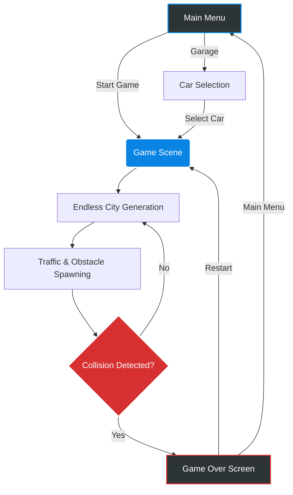

<div align="center">
    
# 🏎️ Highway Crash Game

**An exhilarating, fast-paced 3D endless runner racing game built with Unity.**


[](https://Santhoshcv07.github.io/Highway-Crash-Game)


</div>

---

## 🎯 What it does

**Highway Crash** is an endless 3D racing game where players navigate through heavy traffic in an endlessly generating city environment. The goal is simple: survive as long as possible, dodge incoming traffic, and rack up the highest score. It features an integrated garage for car selection, dynamic traffic spawning, and a highly optimized procedural environment generation system. 

Whether you're dodging trucks or weaving through lanes, one crash means GAME OVER!

---

## ✨ Features

- **🚗 Endless Racing:** Procedurally generated city blocks that keep the highway running infinitely.
- **🚦 Dynamic Traffic System:** AI-controlled traffic cars that spawn continuously to challenge the player.
- **🏎️ Garage & Car Selection:** Unlock and choose from different vehicles with unique handling and visuals.
- **🔊 Immersive Audio:** High-quality engine sounds, crash sound effects, and background music.
- **💥 Smooth Animations:** Includes UI animations (like the Game Over panel) powered by LeanTween for a polished look.
- **📱 WebGL Ready:** Optimized to run flawlessly directly in the web browser.

---

## 🏗️ Architecture & Workflow

Here is how the game flow is structured:



---

## 📂 Folder Structure

```text
Highway-Crash-Game/
│
├── Assets/                 # Core game assets
│   ├── Animation/          # UI and object animations
│   ├── Car Game Sounds/    # Engine, crash, and ambient sounds
│   ├── City Scene/         # 3D models and textures for the environment
│   ├── Garage Assets/      # Assets for the car selection screen
│   ├── Prefabs/            # Reusable game objects (Cars, Traffic, UI)
│   ├── Scenes/             # Unity scenes (MainMenu, Garage, GameLevel)
│   └── Scripts/            # C# scripts for game logic
│       ├── CarController.cs    # Handles player movement and input
│       ├── TraffiicManager.cs  # Manages AI traffic spawning
│       ├── EndlessCity.cs      # Procedural environment generation
│       └── UIManager.cs        # Handles scores and menus
│
├── Packages/               # Unity dependencies and modules
├── ProjectSettings/        # Input, Physics, and Build configurations
└── README.md               # Documentation
```

---

## 🚀 Setup & Deployment
### Prerequisites
- **Unity Hub** & **Unity Editor** (Recommended version: 2022.3 LTS or newer)
- **Git**


### Running the Game Locally
1. **Clone the repository:**
   ```bash
   git clone https://github.com/Santhoshcv07/Highway-Crash-Game.git
   ```
2. **Open in Unity:**
   - Launch Unity Hub.
   - Click `Add` / `Open` and select the cloned repository folder.
   - Wait for Unity to import the assets and resolve packages.
3. **Play the Game:**
   - Navigate to `Assets/Scenes/`.
   - Open the `MainMenu` scene.
   - Hit the **Play** button at the top of the Unity Editor!

### Deployment (WebGL)
1. Go to `File > Build Settings`.
2. Select **WebGL** as the target platform.
3. Click **Switch Platform**.
4. Click **Build**, select an output folder, and upload the generated files to a static hosting service like **GitHub Pages** or **Vercel**.

---

## 🔮 Future Scope & Use Cases


### Use Cases
- **Casual Gaming:** A fun, quick-session game for browser or mobile.
- **Portfolio Project:** Demonstrates proficiency in Unity C# scripting, object pooling, procedural generation, and UI management.

---
Contributions are always welcome! If you'd like to improve the game, follow these steps:

1. Fork the repository.
2. Create a new branch: `git checkout -b feature/new-car-model`
3. Commit your changes: `git commit -m 'Add new sports car'`
4. Push to the branch: `git push origin feature/new-car-model`
5. Open a Pull Request!

## 🤝 Contribution


---

<div align="center">
  <p>Built with ❤️ using Unity</p>
</div>
